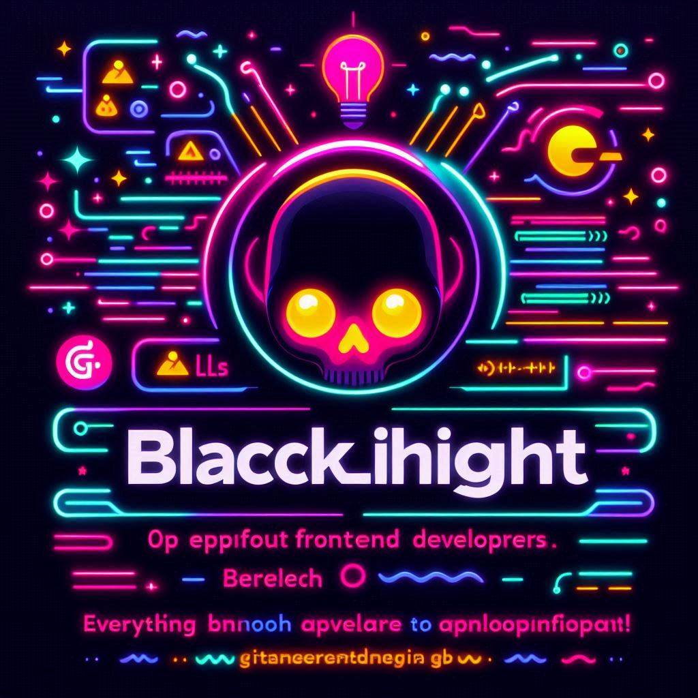

## Hi there 👋 
I'm a Frontend Web Developer driven by a lifelong passion for IT.

I initially worked with a <abbr title="Linux, Apache, MySQL, PHP">LAMP</abbr> stack for most of my experience, but I moved to the <abbr title="MongoDB, Express, React, NodeJS">MERN</abbr> stack a few years ago. My expertise lies in frontend development, though I still tackle backend projects from time to time.

I started exploring computers as a kid, diving into video games, web design, and photography early on. Creating websites made me realize I'd found my calling.

On the back end, I've worked with PHP (pre-Laravel), NodeJS, and CMS systems like Hugo, Joomla, and WordPress.

On the front end, I’ve used tools like jQuery and Bootstrap in the beginning, but I always preferred crafting solutions with well-structured CSS and vanilla JavaScript. In the meantime building projects using TypeScript and React I find it interesting.

While computers are at the heart of all my interests, I also love the classic nerd hobbies: video games and Science Fiction/Fantasy, but also biking and gardening.

Most importantly, my wife and son are my greatest inspirations.

I was born and raised in Thuringia, and I've been fortunate enough to visit and live in various places. Along the way, I’ve picked up a lot of inspiration and ideas.

- 🔭 I'm currently working on building a portfolio from my past projects and a few new ideas.
- 🌱 I’m currently learning to use Salesforce with React.
- 💬 Ask me about interesting JavaScript or CSS challenges.
- 📫 You can reach me [@Blacklight@mastodon.social](https://mastodon.social/@Blacklight)

While my portfolio is being finalized, you can take a look at some of my recent projects at [CodePen](https://codepen.io/blacklightdesign).

<!--
## My Tools

**Blacklightdesign/Blacklightdesign** is a ✨ _special_ ✨ repository because its `README.md` (this file) appears on your GitHub profile.

Here are some ideas to get you started:

- 🔭 I’m currently working on ...
- 🌱 I’m currently learning ...
- 👯 I’m looking to collaborate on ...
- 🤔 I’m looking for help with ...
- 💬 Ask me about ...
- 📫 How to reach me: ...
- 😄 Pronouns: ...
- ⚡ Fun fact: ...
-->
